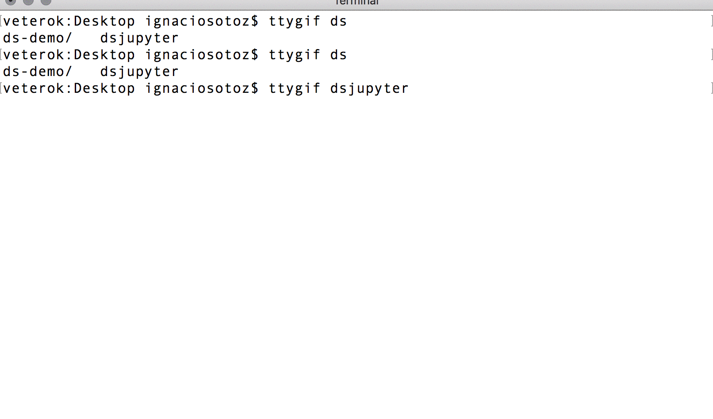

# Data Science desde Cero con Python

Para este taller necesitamos instalar Python 3.6 y Jupyter. Para eso utilizaremos Anaconda, un instalador que se preocupará de generar todo lo necesario para nuestra estación de trabajo. Pueden descargar anaconda en el siguiente link [https://www.anaconda.com/download/](https://www.anaconda.com/download/).

Para generar nuestro primer notebook, abrimos el Terminal y ejecutamos `jupyter notebook`. Los pasos se encuentran detallados en el siguiente gif.

Para más detalles sobre el flujo de trabajo con Jupyter Notebook, refiérase a la [Guía de Trabajo](toolkit_jupyter.md)

## ¿Qué contiene este repositorio? 

* [Tookit Jupyter](toolkit_jupyter.md): Instructivos de instalación y flujo de trabajo con Jupyter. La versión `.pdf` puede ser descargada [acá](./toolkit_jupyter.pdf)
* [tips.csv](./tips.csv/): Base de datos a utilizar en los ejercicios.
* [toolkit_img](./toolkit_img/): Imágenes insertadas en `markdown_jupyter.md`.
* `pres`: Presentación del workshop. Abrir [./pres/index.html](./pres/index.html) en un navegador para visualizar.

