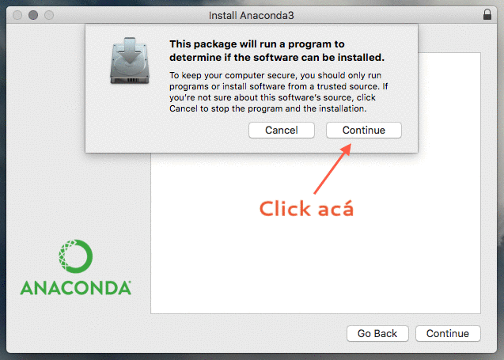

# Data Science desde Cero con Python

> We're drowning in information and starving for knowledge. - John Naisbitt

Estamos en un momento donde todo el mundo está generando información de manera constante. Desde transacciones bancarias a encuestas de satisfacción, la omnipresencia de los datos en industrias, gobiernos y disciplinas nos obliga a aprender a manipular datos para entender el mundo. La comprensión y análisis de éstos resulta fundamental para el éxito de proyectos y nos entrega herramientas valiosas que pueden abrir oprtunidades.

Como un campo híbrido entre Ciencias de la Computación, Matemática y Estadística, y Negocios, Data Science se sirve de estos elementos para desarrollar explicaciones, identificar patrones y predecir resultados que nos ayuden a comprender el mundo y tomar mejores decisiones.

Para este taller utilizaremos __Python__ como nuestro motor de análisis. Desde su irrupción en los 90's, Python se ha establecido como uno de los principales lenguajes de programación utilizado en la industria y la academia para el análisis de datos, dado su simplicidad y amplia gama de utilidades que ofrece al usuario.

El objetivo de este taller es realizar un ejercicio práctico donde trabajaremos con una tabla de datos estructurados en un archivo `.csv`. Para ello, nos valeremos de `numpy`, `pandas` y `matplotlib`, las tres librerías escenciales para el análisis, más otras librerías para modelar datos.

Mediante este ejercicio aprenderás a manipular, graficar y analizar datos, sin la necesidad de tener conocimientos previos de Data Science.

### Jupyter Notebook: Python + Texto

Jupyter Notebook (antes denominado iPython Notebook) es un ambiente de trabajo que busca unificar las herramientas de documentación y ejecución de código en un mismo archivo. Los notebooks permite la lectura fácil para los humanos, así como la compartimentalización del código para la máquina.

## Instalación de Herramientas

Para este taller necesitamos instalar Python 3.6 y Jupyter. Para eso utilizaremos Anaconda, un instalador que se preocupará de generar todo lo necesario para nuestra estación de trabajo. Pueden descargar anaconda en el siguiente link [https://www.anaconda.com/download/](https://www.anaconda.com/download/).

## Pasos a seguir

1. Descargar Anaconda con la versión 3.6 en [https://www.anaconda.com/download/](https://www.anaconda.com/download/)
2. Instalar Anaconda en tu equipo. Los pasos se encuentran detallados en el siguiente gif

3. Para generar nuestro primer notebook, abrimos el Terminal y ejecutamos `jupyter notebook`. Los pasos se encuentran detallados en el siguiente gif.

4. Es necesario que lean la guía de trabajo para entender algunos conceptos previos al curso. Descargue acá la [guía de trabajo](toolkit_jupyter.md)([Versión PDF](toolkit_jupyter.pdf)).

## ¿Qué contiene este repositorio? 

* [Tookit Jupyter](toolkit_jupyter.md): Instructivos de instalación y flujo de trabajo con Jupyter. La versión `.pdf` puede ser descargada [acá](./toolkit_jupyter.pdf)
* [tips.csv](./tips.csv/): Base de datos a utilizar en los ejercicios.
* [toolkit_img](./toolkit_img/): Imágenes insertadas en `markdown_jupyter.md`.
* `pres`: Presentación del workshop. Abrir [./pres/index.html](./pres/index.html) en un navegador para visualizar.

