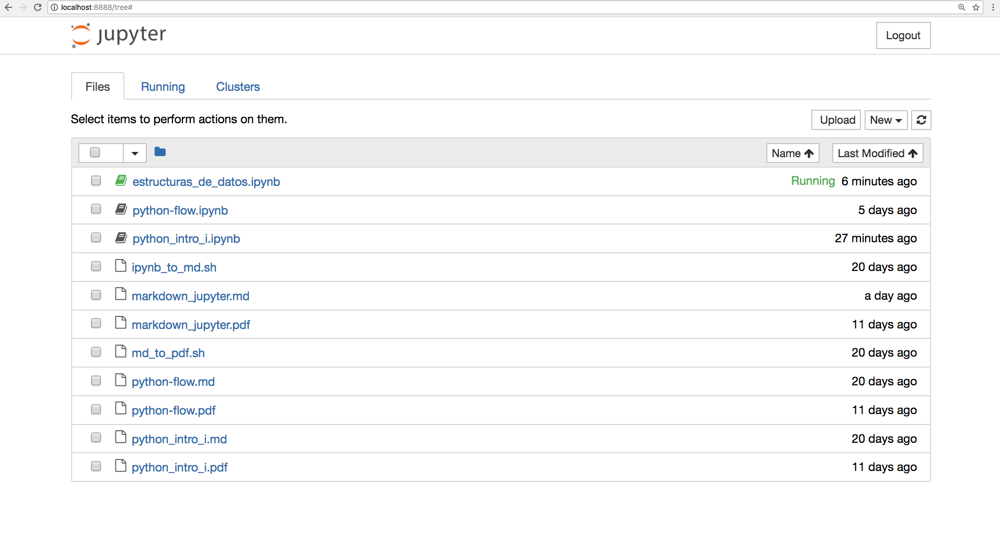
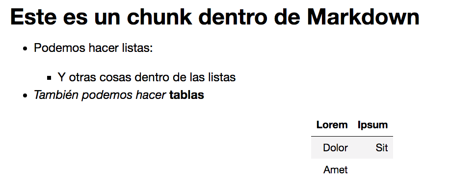

El objetivo de este documento es presentar los elementos que utilizaremos para el workshop de visualización de datos. Las herramientas se encuentran contenidas en un sistema de administración llamado `Anaconda`.
> El toolkit que se presenta es un sistema que permite generar documentación ordenada de manera afable, así como la mantención de nuestro sistema de trabajo.
> El sistema está centrado Anaconda, Python, Markdown, Jupyter y el Terminal. Cada herramienta presenta una función específica respecto al toolkit.


# Anaconda: nuestro sistema de administración

Anaconda es una distribución de código abierto, diseñada específicamente para tareas asociadas al análisis de datos y computación científica. El objetivo es el sintetizar y unificar el conjunto de buenas prácticas en la mantención, administración y desarrollo de los proyectos.

Anaconda presenta dos versiones para descargar:

1. Anaconda Distribution: Versión completa con una amplia variedad de paquetes de Python y R ya instalados. Pesa alrededor de 3GB. $\rightarrow$ [Link](https://www.anaconda.com/download/). __Escojan la versión 3.6__
2. Miniconda: Versión reducida con las instalaciones básicas. Se recomienda instalar esta versión no solo dado lo reducido, también les ayudará a soltar los dedos con la instalación de módulos y generación de ambientes virtuales. $\rightarrow$ [Link](https://conda.io/miniconda.html). __Escojan la versión 3.6__.
    * Si van a instalar miniconda, informen para asistirlos.

Anaconda presenta su versión desde la línea de comando, llamada `conda`. A lo largo del curso enfatizaremos el uso de la línea de comando. A continuación se presenta una lista de comandos que pueden ser útiles para la administración:


 | Comando                 | Objetivo                                                       | 
 | --------                | ----------                                                     | 
 | `conda info`            | Verificar versión de anaconda                                  | 
 | `conda install PAQUETE` | Instalar un paquete en anaconda                                | 
 | `conda list`            | Enlistar todos los paquetes instalados en nuestra distribución | 
 | `conda remove PAQUETE`  | Eliminar un paquete de nuestra distribución                    | 
 | `conda update PAQUETE`  | Actualizar un paquete de nuestra distribución                  | 


# Python: nuestro motor

Python es un lenguaje por Guido van Rossum en 1991, con la intención de hacer un lenguaje con mínimas distracciones sintácticas. Dada la economización del lenguaje, en Python se prioriza la existencia de _una solución que debe ser universal_, esta solución se le conoce informalmente como __pythonic solution__. 

Algunas características de Python:

* Interpretado: Ejecuta las implementaciones del código de forma directa, sin necesidad de ser compilado de forma previa.
* Dinámico: La definición de la tipificación se realiza durante la ejecución y no durante compilación. Esto significa que el programador pasa menos tiempo definiendo aspectos abstractos de su código, y más tiempo en los substancial.
* Orientado a objetos: Enfoca la tarea del programador a cómo manipular objetos por sobre acciones, y datos por sobre lógica. Esto va de la mano con la definción dinámica.
* De alto nivel: Busca abstraerse de los detalles del computador y se acerca más al lenguaje humano en la forma de procesar.


Todo lo anterior se resume en que Python reduce la barrera de asimilación, desarrollándose como un lenguaje afable y ameno. La filosofía de Python se puede entender a partir del _Zen de Python_:

> * Hermoso es mejor que feo.
> * Explícito es mejor que implícito.
> * Simple es mejor que complejo.
> * Complejo es mejor que complicado.
> * Plano es mejor que anidado.
> * Disperso es mejor que denso.
> * La legibilidad importa.
> * Los casos especiales no son lo suficientemente especial como para romper las reglas.
> * La funcionalidad vence a la belleza.
> * Los errores nunca deben ser silenciados.
> * A menos que sean silenciados explícitamente.
> * Frente a la ambiguedad, abstenerse de adivinar.
> * Debe existir una -y preferentemente sólo una - forma obvia de hacer las cosas.
> * Aún cuando esa forma no sea obvia, a menos que seas Holandés.
> * Ahora es mejor que nunca.
> * Aún cuando nunca casi siempre es mejor que __ahora mismo__.
> * Si la implementación es difícil de explicar, es una mala idea.
> * Si la implementación es fácil de explicar, quizás sea una buena idea.
> * Los namespaces son una gran idea, hagamos más de esos!


## Python 2.x y 3.x

Un contratiempo de Python es el tiempo que se ha demorado en declarar su versión 2.x como obsoleta. Esto ha generado que la comunidad de Python tenga que operar en dos variantes. El fin del 2.7 está programado para 2020, así que es una buena idea acostumbrarse al formato 3.x.


## Diccionario Python $\Leftrightarrow$ Español

* __Argument:__ Valor asignado a una función o programa cuando se ejecuta. Se ocupa de forma intercambiable con el término _parameter_
* __Assertion:__ Una expresión que se asume como verdadera en un punto particular del programa. Por lo general se utilizan _assertions_ para identificar errores de forma explícita (Esto se conoce como _programación defensiva_).  
* __Assign:__ Asociación de un valor con una `variable`
* __Body:__ El cuerpo de una función o clase. Se define bajo la definición

```python
def funcion(x):
    cuerpo que ejecuta acciones en x
```

* __Boolean operators:__ Operadores lógicos (`and`, `or` y `not`) que permite expandir la evaluación de argumentos. No confundir con _Boolean values_ (`True` y `False`).
* __Case Sensitive:__ 
* __Case Insensitive:__
* __Comment:__ Una nota dentro de un programa que no es interpretada por el lenguaje. Sirve como guía para el humano.
* __Compose:__ Función compuesta que resulta de aplicar una función dentro de otra $\leadsto$ `f(g(x))`.
* __Conditional Statement:__ Una declaración dentro de un programa que puede ser o no ejecutada, dependiendo del resultado de una prueba. También se les conoce como expresiones booleanas.
* __Default Value:__ Valor que se define para el parámetro de una función en caso no especificar explícitamente algo.
* __Delimiter__ Carácter o lista de caracteres utilizados para separar valores individuales
* __Docstring:__ String de documentación. Es la representación textual que se escribe dentro de un programa/clase/función en Python. Un `docstring` puede ser visualizado de forma interactiva en el programa, llamando `objeto.__doc__`. Esto, a diferencia de los comentarios, que no pueden ser visualizados de forma interactiva.
* __Dotted Notation:__ Sintáxis de acceso en variados lenguajes para acceder a componentes dentro de objetos de la siguiente forma canónica $\leadsto$ `objeto.componente`.
* __Floating point number:__ Número que contiene una parte real y un decimal. $\leadsto$ 5.6
* __Inmutable:__ Dato que no se puede cambiar después de su creación.
* __Import:__ Cargar una librería o módulo en un programa.
* __In place operators:__ Un operador como `+=` que sirve como un atajo para operaciones comunes. Por ejemplo, si deseamos actualizar el valor de `x`:

```python
# forma clásica
x = x + 3

#forma express
x += 3
```

* __Integer:__ Número completo $\leadsto$ 435.
* __Library:__ Un conjunto de scripts (clases/funciones/variables) que implementan una serie de tareas relacionadas.
* __Method:__ Una función asociada a un objeto específico. 
* __Object:__ Colección de variables asociadas a funciones específicas (métodos).
* __Parameter:__ Variable declarada dentro de la función qeu permite pasar el valor a la llamada de ésta.
* __Pipeline:__ Conexiones realizadas entre el output de un programa al input de otro.
* __Return statement:__ Declaración que ocasiona el fin de la ejecución de una función y retorna un valor de forma inmediata.
* __Slice:__ Subsecuencia de un conjunto mayor
* __Stack frame:__ La estructura de datos que provee asignación para las variables locales de una función. Cada vez que se invoca una función, se crea un nuevo stack frame y se prioriza en el call stack. 
* __Standard input:__ El flujo de elementos ingresados en una función. 
* __Standard output:__ El flujo de elementos salientes en una función.
* __String:__ Secuencia de cero o más caracteres alfanuméricos. Si un número es ingresado en un string, no se interpreta como `int` o `float`.
* __Traceback:__ La secuencia de llamadas de una función que conlleva a un error.
* __Tuple:__ Secuencia inmutable de valores.
* __Type of Error:__ Indica la naturaleza del error en el programa.

# Markdown: un formato afable de escritura

Es un lenguaje de marcas minimalista cuyo eje central es la conversión fácil a `html` y otros formatos[^1]. Markdown permite escribir utilizando un lenguaje __fácil de leer y escribir__

  | Elemento                        | Sintáxis Markdown         | 
  | ---------                       | -------------------       | 
  | `# Titulo`                      | Título principal          | 
  | `## Subtítulo `                 | Subtítulo                 | 
  | `### Subsubtítulo`              | Subsubtítulo              | 
  | `#### Párrafo`                  | Párrafo                   | 
  | `_Cursiva_` o `*Negrita*`       | _cursiva_                 | 
  | `__Negrita__` o `**Negrita**`   | __Negrita__               | 
  | `[text](http://address)]`       | Inserción de hipervínculo | 
  | `` | Inserción de imágen       | 

Las listas pueden ser ordenadas o no ordenadas. Para las listas no ordenadas, precedemos cada elemento con `*`:

* Esta
* es
* una
* lista

Para las listas ordenadas, precedemos cada elemento con un número:

1. Esta
2. Es
3. Otra
4. Lista

Se pueden agregar metadatos mediante un YAML[^2]

# Jupyter: Python + Markdown = <3

Jupyter Notebook (antes denominado iPython Notebook) es un ambiente de trabajo que busca unificar las herramientas de documentación y ejecución de código en un mismo archivo. Los notebooks permite la lectura fácil para los humanos, así como la comparmentimentalización del código para la máquina.


Jupyter acepta dos tipos de _chunks_ (códigos): un formato de texto, preferentemente Markdown; y un _kernel_, que es el motor computacional que vincula la interpretación del código en el chunk mediante un lenguaje.


Jupyter expandió su funcionalidad a más de cuarenta lenguajes, destacando Javascript, Ruby, R, Julia, Haskell, etc... Aprender su funcionalidad básica es una buena idea para escribir documentación y otros.


## Algunos tips para entender Jupyter

1. Jupyter funciona por chunks: Cada chunk puede contener texto __ó__ código. Algunas funciones sobre los chunks. Cada función debe estar en el modo de comando (esto significa que deben presionar `Esc` antes de ejecutar)

  | Combinación de teclas   | Acción                                              | 
  | ----------------------- | --------                                            | 
  | `<Enter>`               | Entrar en el modo edición                           | 
  | `<Shift> + <Enter>`     | Ejecutar chunk y crear nuevo chunk                  | 
  | `<Control> + <Enter>`   | Ejecutar chunk, no moverse                          | 
  | `<Tab>`                 | Invocar autocompletado (ver todas las opciones)     | 
  | `<Shift> + <Tab>`       | Ver documentación sobre la función                  | 
  | `M`                     | Cambiar la modalidad del chunk de código a markdown | 
  | `Y`                     | Cambiar la modalidad del chunk de markdown a código | 
  | `A`                     | Insertar chunk arriba                               | 
  | `B`                     | Insertar chunk abajo                                | 
  | `DD`                    | Eliminar chunk                                      | 

2. Dado que opera en base a chunks, su formato en sí es un poco ininteligible (es básicamente un `.json` con extensión `.ipynb`). Hay algunas alternativas que pueden resultar útiles más adelante:
    - Github soporta `.ipynb` y los visualiza en la página.
    - Jupyter ofrece opciones para convertir `.ipynb` a `.html`, `.doc` y `.pdf`.
3. Jupyter funciona desde un navegador web por medio de un servidor. Es un buen consejo familiarizarse con los siguientes pasos:
    - En el terminal, escriba `jupyter notebook`. En este paso está inicializando el servidor de manera local.
    - Por lo general, `jupyter` abrirá el navegador web de forma automática. Si por X motivo el navegador se cierra; no se preocupe, jupyter sigue corriendo. Vuelva al navegador y dirígase a `http://localhost:8888/`


4. Dentro de `localhost:8888`, jupyter mostrará todos los documentos dentro del working directory.



5. Para iniciar un notebook, hacemos click en _New_ y seleccionamos `Python 3`.


6. Para ejecutar python dentro del notebook, procuramos que el costado izquierdo del chunk presente `In [  ]`. Una vez que el chunk sea ejecutado con `Shift + Enter`, obtendremos un número asociado dentro de `In [  ]` y un output con `Out [  ]:`


7. Para ejecutar Markdown dentro del chunk, procuramos cambiar el modo. Si estamos en lo correcto, el contenido estará destacado siguiendo la sintáxis de Markdown.


8. Ejecutando `Shift + Enter` obtendremos la versión HTML en el notebook.




# Terminal: nuestra manera de interactuar con el computador

> Addenda: A lo largo del curso utilizaremos los términos _línea de comando_, _consola_, _terminal_ y _cli_ de forma intercambiable.

El terminal es un medio de interacción con el computador donde el usuario envía comandos en forma de texto que deben ser interpretados por el computador. El terminal fue la forma más común de interactuar con el computador en sus inicios, en detrimento de las interfaces gráficas.

## Sí, genial. ¿Pero por qué debo utilizar una tecnología obsoleta?

1. Sumarás hackerpuntos: Tendrás mayor credibilidad en el círculo si dices que haces todo en el terminal (?)
2. Permite sistematizar y automatizar acciones frecuentes.
3. Uno decide qué hacer con el computador, no está restringido a las opciones disponibles en la interfaz gráfica.
4. Los servidores se siguen administrando via terminal. No escaparás de interactuar con un servidor.

## Algunos comandos básicos

* `pwd` $\leadsto$ Ver el directorio en que me sitúo.
* `cd <DIRECTORIO>` $\leadsto$ Cambiar al directorio detallado.
* `ls` $\leadsto$ Listar los archivos del directorio en el que me sitúo.
* `ls -lah` $\leadsto$ Listar todo los archivos del directorio, en formato humano y ordenado.
* `mkdir <DIRECTORIO>` $\leadsto$ Crear un directorio.
* `touch <ARCHIVO>.<EXTENSION>` $\leadsto$ Crear un archivo con nombre `archivo` y extensión `.extensión`.
* `rm <ARCHIVO>` $\leadsto$ Eliminar archivos.


[^1]: Esto se puede lograr mediante [pandoc](http://pandoc.org)
[^2]: [YAML Ain't Markup Language](http://yaml.org/) 
