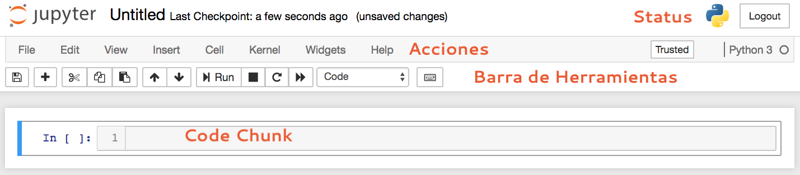

> El objetivo de este documento es presentar los elementos que utilizaremos para el workshop de visualización de datos. Las herramientas se encuentran contenidas en un sistema de administración llamado `Anaconda`.
> El toolkit que se presenta es un sistema que permite generar documentación ordenada de manera afable, así como la mantención de nuestro sistema de trabajo.
> El sistema está centrado Anaconda, Python, Markdown, Jupyter y el Terminal. Cada herramienta presenta una función específica respecto al toolkit.

# Anaconda: nuestro sistema de administración

Anaconda es una distribución de código abierto, diseñada específicamente para tareas asociadas al análisis de datos y computación científica. El objetivo es el sintetizar y unificar el conjunto de buenas prácticas en la mantención, administración y desarrollo de los proyectos.

Para instalar la distribución Anaconda, pueden dirigirse a [https://www.anaconda.com/download/ ](https://www.anaconda.com/download/) y escojer la __versión 3.6__. Esta distribución instala Python 3.6 y Jupyter Notebook, en adición a las principales librerías para Data Science con Python. De forma alternativa se puede instalar Miniconda, una distribución más liviana con menos prestaciones.

# Markdown: un formato afable de escritura

Es un lenguaje de marcas minimalista cuyo eje central es la conversión fácil a `html` y otros formatos[^1]. Markdown permite escribir utilizando un lenguaje __fácil de leer y escribir__

| Elemento                        | Sintáxis Markdown         | 
| ---------                       | -------------------       | 
| `# Titulo`                      | Título principal          | 
| `## Subtítulo `                 | Subtítulo                 | 
| `### Subsubtítulo`              | Subsubtítulo              | 
| `#### Párrafo`                  | Párrafo                   | 
| `_Cursiva_` o `*Negrita*`       | _cursiva_                 | 
| `__Negrita__` o `**Negrita**`   | __Negrita__               | 
| `[text](http://address)]`       | Inserción de hipervínculo | 
| `` | Inserción de imágen       | 

Las listas pueden ser ordenadas o no ordenadas. Para las listas no ordenadas, precedemos cada elemento con `*`:

* Esta
* es
* una
* lista

Para las listas ordenadas, precedemos cada elemento con un número:

1. Esta
2. Es
3. Otra
4. Lista

Se pueden agregar metadatos mediante un YAML[^2]

# Jupyter: Python + Markdown 

Jupyter Notebook (antes denominado iPython Notebook) es un ambiente de trabajo que busca unificar las herramientas de documentación y ejecución de código en un mismo archivo. Los notebooks permite la lectura fácil para los humanos, así como la compartimentalización del código para la máquina.

Jupyter acepta dos tipos de _chunks_ (códigos): un formato de texto, preferentemente Markdown; y un _kernel_, que es el motor computacional que vincula la interpretación del código en el chunk mediante un lenguaje.

Jupyter expandió su funcionalidad a más de cuarenta lenguajes, destacando Javascript, Ruby, R, Julia, Haskell, etc... Aprender su funcionalidad básica es una buena idea para escribir documentación y otros.

## Algunos tips para entender Jupyter

1. Jupyter funciona por chunks: Cada chunk puede contener texto __ó__ código. Algunas funciones sobre los chunks. Cada función debe estar en el modo de comando (esto significa que deben presionar `Esc` antes de ejecutar)

| Combinación de teclas   | Acción                                              | 
| ----------------------- | --------                                            | 
| `<Enter>`               | Entrar en el modo edición                           | 
| `<Shift> + <Enter>`     | Ejecutar chunk y crear nuevo chunk                  | 
| `<Control> + <Enter>`   | Ejecutar chunk, no moverse                          | 
| `<Tab>`                 | Invocar autocompletado (ver todas las opciones)     | 
| `<Shift> + <Tab>`       | Ver documentación sobre la función                  | 
| `M`                     | Cambiar la modalidad del chunk de código a markdown | 
| `Y`                     | Cambiar la modalidad del chunk de markdown a código | 
| `A`                     | Insertar chunk arriba                               | 
| `B`                     | Insertar chunk abajo                                | 
| `DD`                    | Eliminar chunk                                      | 

2. Dado que opera en base a chunks, su formato en sí es un poco ininteligible (es básicamente un `.json` con extensión `.ipynb`). Hay algunas alternativas que pueden resultar útiles más adelante:
    - Github soporta `.ipynb` y los visualiza en la página.
    - Jupyter ofrece opciones para convertir `.ipynb` a `.html`, `.doc` y `.pdf`.

### Iniciando jupyter notebook

1. Jupyter funciona desde un navegador web por medio de un servidor. Es un buen consejo familiarizarse con los siguientes pasos:
    - En el terminal, escriba `jupyter notebook`. En este paso está inicializando el servidor de manera local.
   - Por lo general, `jupyter` abrirá el navegador web de forma automática. Si por algún motivo el navegador se cierra; no se preocupe, jupyter sigue corriendo. Vuelva al navegador y dirígase a `http://localhost:8888/`

2. Una vez dentro de `localhost:8888`, Jupyter mostrará todos los documentos dentro del working directory. El working directory se iniciará donde se ejecutó `jupyter notebook`

3. Para iniciar un notebook, hacemos click en _New_ y seleccionamos `Python 3`.

4. Un notebook nuevo sin contenido tendrá la siguiente apariencia. Dentro de éste se encontrarán varios elementos a considerar:

*  En la esquina superior derecha se encuentran los indicadores de __status__, que informa sobre el estado del notebook y el kernel. Acá se informa si existe algún problema en el ambiente de trabajo.
*  En la barra de __Acciones__ se encuentran las funciones que permiten administrar el notebook, tales como exportación a otros formatos, guardar notebook, reiniciar el kernel, etc...
*  La __Barra de Herramientas__ contiene atajos a las acciones más utilizadas dentro del notebook.
*  Dentro del __Code Chunk__ es donde se inserta el código y texto.

5. El __Code Chunk__ presenta dos modalidades:
	* __Modo Python__: En este modo se escribe el código que posteriormente será evaluado con el kernel de python.
	* __Modo Markdown__:  En este modo se escribe texto siguiendo el formato Markdown, que posteriormente será evaluado y representado con HTML.

6. Para escribir en el Modo Python, nos aseguramos que el modo `code` esté seleccionado en nuesta barra de herramientas. Si todo está funcionando adecuadamente, al lado izquierdo del chunk deberíamos ver un `In [ ]`.

* Para ejecutar nuestro primer chunk, digitamos `Shift + Enter`. Si el código no presenta problemas, nos devolverá el resultado interpretado por Python. El indicador `In [1]` alojará un número, que representa el orden de ejecución en el notebook. 

7. Para ejecutar Markdown dentro del chunk, procuramos cambiar el modo. Si estamos en lo correcto, el contenido estará destacado siguiendo la sintáxis de Markdown.

8. Ejecutando `Shift + Enter` obtendremos la versión HTML en el notebook.

 
